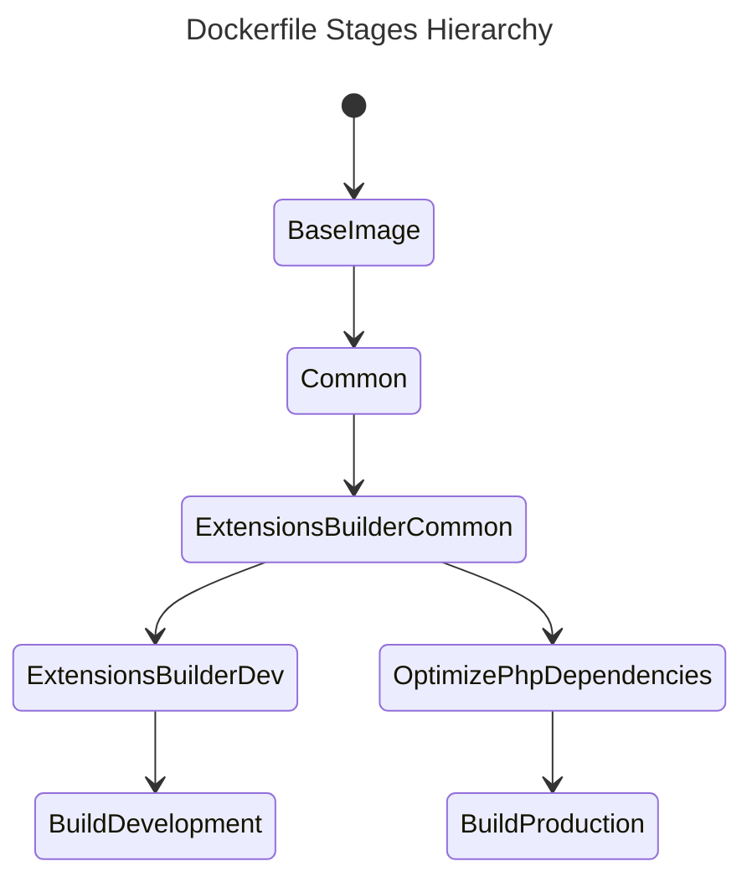

[](https://github.com/fonil/dockerized-php/actions/workflows/ci.yml)

# Dockerized PHP


> A _dockerized_ environment based on Caddy + PHP-FPM running on a Linux Alpine container. 


[TOC]

------


## Summary

This repository contains a _dockerized_ environment for building PHP applications based on **php:8.3.8-fpm-alpine** with Caddy support.

### Highlights

- Unified environment to build <abbr title="Command Line Interface">CLI</abbr>, <u>web applications</u> and/or <u>micro-services</u> based on **PHP8**.
- Allows you to create an optimized **development environment** Docker image
- Allows you to create an optimized **production-ready** Docker image
-  **Self-signed local domains** thanks to Caddy.


------


## Requirements

To use this repository you need:

- [Docker](https://www.docker.com/) - An open source containerization platform.
- [Git](https://git-scm.com/) - The free and open source distributed version control system.
- [Make](https://www.gnu.org/software/make/) - A command to automate the build/manage process.


------


## Built with

| Type           | Component                                                | Description                                                  |
| -------------- | -------------------------------------------------------- | ------------------------------------------------------------ |
| Infrastructure | [Docker](https://www.docker.com/)                        | Containerization platform                                    |
| Service        | [Caddy Server](https://caddyserver.com/)                 | Open source web server with automatic HTTPS written in Go    |
| Service        | [PHP-FPM](https://www.php.net/manual/en/install.fpm.php) | PHP with FastCGI Process Manager                             |
| Miscelaneous   | [Bash](https://www.gnu.org/software/bash/)               | Allows to create an interactive shell within containerized service |
| Miscelaneous   | [Make](https://www.gnu.org/software/make/)               | Allows to execute commands defined on a _Makefile_           |


------


## Getting Started

Just clone the repository into your preferred path:

```bash
$ mkdir -p ~/path/to/my-new-project && cd ~/path/to/my-new-project
$ git clone git@github.com:fonil/dockerized-php.git .
```

### Conventions

#### Dockerfile

`Dockerfile` is based on [multi-stage builds](https://docs.docker.com/build/building/multi-stage/) in order to simplify the process to generate the **development container image** and the optimized **production-ready container image**.

##### Default Stages

| Name                        | Description                                                  |
| --------------------------- | ------------------------------------------------------------ |
| `base-image`                | Used to define the base Docker image                         |
| `common`                    | Used to define generic variables: `WORKDIR`, `HEALTCHECK`, etc. |
| `extensions-builder-common` | Used to build generic PHP extensions                         |
| `extensions-builder-dev`    | Used to build **development** PHP extensions                 |
| `build-development`         | Used to build the development environment                    |
| `optimize-php-dependencies` | Used to optimize the PHP dependencies in production by removing the development ones |
| `build-production`          | Used to build the **production** environment                 |

###### Default Stages Hierarchy



##### Health check

A custom health check script is provided to check the container service by performing a `PHP-FPM` `ping/pong` check. 

You can find this shell script at `build/healthcheck.sh`.


> [!NOTE]
>
> Review the `Dockerfile` file and adjust the `HEALTHCHECK` directive options accordingly.


> [!IMPORTANT]
>
> Remember to rebuild the Docker image if you make any change on this file.


##### Non-Privileged User

Current container service uses a **non-privileged user** to execute `PHP-FPM`, with same User/Group ID than the host user.

This mechanism allows to `PHP-FPM` create/update shared resources within the host with the same credentials than current host user, avoiding possible file-permissions issues.

To create this user in the container service, current host user details are collected in the `Makefile` and passed to Docker `build` command as arguments:

| Argument          | Default value   | Required value        | Description                |
| ----------------- | --------------- | --------------------- | -------------------------- |
| `HOST_USER_NAME`  | host-user-name  | `$ id --user --name`  | Current host user name     |
| `HOST_GROUP_NAME` | host-group-name | `$ id --group --name` | Current host group name    |
| `HOST_USER_ID`    | 1001            | `$ id --user`         | Current host user ID       |
| `HOST_GROUP_ID`   | 1001            | `$ id --group`        | Current host user group ID |


> [!NOTE]
>
> Review the `Makefile` and `Dockerfile` files and adjust the arguments to your convenience.


> [!IMPORTANT]
>
> Remember to rebuild the Docker image if you make any change on `Dockerfile` file.


#### Logging

The container service logs to `STDOUT` by default.

#### Project Structure

```text
├── build                           # Docker-related configuration files
│   ├── Caddyfile                   # Caddy's configuration file
│   ├── healthcheck.sh              # Shell script for Docker's HEALTHCHECK  directive
│   ├── www.conf                    # PHP-FPM configuration file
│   └── xdebug.ini                  # xDebug configuration file
├── coverage                        # Code Coverage HTML report target folder
├── src                             # PHP application folder
├── caddy-root-ca-authority.crt     # Generated certificate file with Caddy Root CA Authority details
├── docker-compose.yml
├── Dockerfile
├── Makefile
└── README.md                       # This file
```

##### Volumes

There are some volumes created between the *host* and the container service:

| Host path    | Container path | Description                             |
| ------------ | -------------- | --------------------------------------- |
| `./src`      | `/code`        | PHP application folder                  |
| `./coverage` | `/coverage`    | Code Coverage HTML report target folder |


> [!NOTE]
>
> Review the `docker-compose.yml` and volumes to your convenience.


> [!IMPORTANT]
>
> Remember to restart the container service if you make any change in `docker-compose.yml`.


##### Available Commands

A *Makefile* is provided with following commands:

```bash
~/path/to/my-new-project$ make

╔══════════════════════════════════════════════════════════════════════════════╗
║                                                                              ║
║                           .: AVAILABLE COMMANDS :.                           ║
║                                                                              ║
╚══════════════════════════════════════════════════════════════════════════════╝

· build                          Docker: builds the service
· up                             Docker: starts the service
· restart                        Docker: restarts the service
· down                           Docker: stops the service
· logs                           Docker: exposes the service logs
· bash                           Docker: establish a bash session into main container
· install-caddy-certificate      Setup: installs Caddy Local Authority certificate
· show-context                   Setup: show context
```

#### Web Server

This project uses Caddy as main web server which <u>provides HTTPS by default</u>.


> [!WARNING]
>
> Caddy is optional and you can replace/remove it based on your preferences.


##### Default Domain

The default website domain is `https://website.localhost`.

Any `.localhost` TLD resolves by default to `127.0.0.1` so no any additional action is required on your *host*.


> [!NOTE]
>
> Review the `build/Caddyfile` and apply the changes based on your preferences.
>
> Review the `Makefile` to ensure `WEBSITE_URL` constant has the desired domain URL.


> [!IMPORTANT]
>
> Remember to restart the container service if you make any change in `build/Caddyfile` file.


##### Certificate Authority (CA) & SSL Certificate

You can generate/register the **Caddy Authority Certificate** in order to get `SSL` support .


> [!NOTE]
>
> Just execute `make install-caddy-certificate` and follow the provided guidelines to generate the Caddy Authority Certificate and install it on your host.


> [!IMPORTANT]
>
> Remember to reinstall the certificate if you rebuild the container service.


#### PHP Application

PHP application must be placed into `src` folder.


> [!TIP]
>
> Please consider using [PHP Skeleton](https://github.com/fonil/php-skeleton) as boilerplate when creating `PHP` applications from scratch.


##### Testing

###### Mocking Date/Time functions

Testing with date and/or time variations sometimes can be a nightmare. To assist on this topic the **UOPZ** extension has been installed and enabled by default.


> [!TIP]
>
> You can use [slope-it/clock-mock](https://github.com/slope-it/clock-mock) as a development dependency when mocking date/time functions. 


### Development Environment

#### Build Docker Image

##### Linux Based Hosts

```bash
$ make build
```

##### Windows Hosts

```bash
$ docker compose build
```

#### Access to Container

##### Linux Based Hosts

```bash
$ make bash
```

##### Windows Hosts

```bash
$ docker run -it --rm app:development bash
```

### Production Environment

#### Build Docker Image

##### Linux Based Hosts

```bash
$ docker buildx build --target=build-production --tag="app:production" .
```

##### Windows Hosts

```bash
$ docker buildx build --target=build-production --tag="app:production" .
```

#### Access to Container

##### Linux Based Hosts

```bash
$ docker run -it --rm app:production sh
```

##### Windows Hosts

```bash
$ docker run -it --rm app:production sh
```


------


## Security Vulnerabilities

Please review our security policy on how to report security vulnerabilities:

**PLEASE DON'T DISCLOSE SECURITY-RELATED ISSUES PUBLICLY**

### Supported Versions

Only the latest major version receives security fixes.

### Reporting a Vulnerability

If you discover a security vulnerability within this project, please [open an issue here](https://github.com/fonil/dockerized-php/issues). All security vulnerabilities will be promptly addressed.


------


## License

The MIT License (MIT). Please see [LICENSE](./LICENSE) file for more information.
