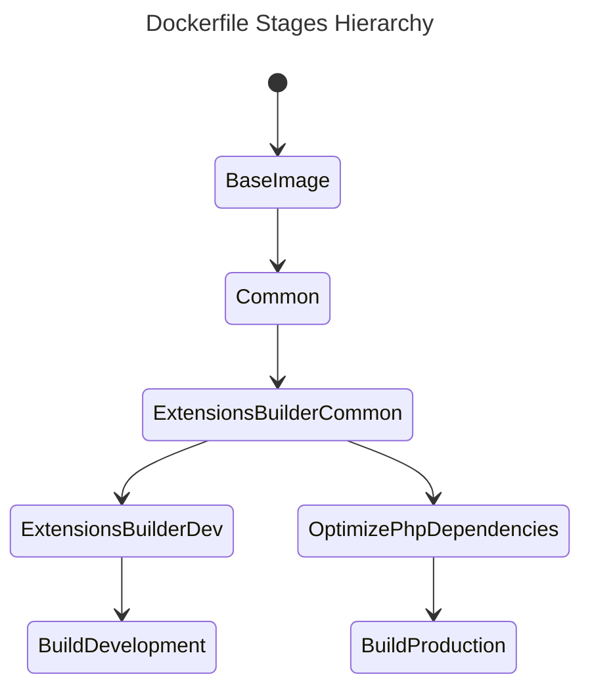
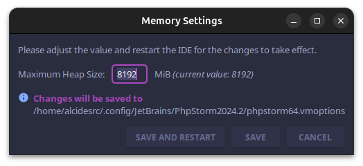
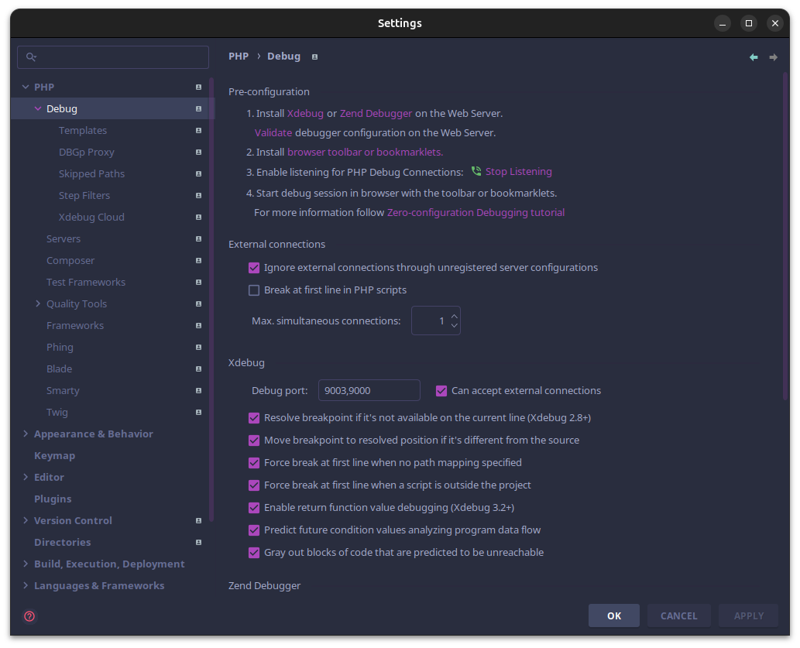
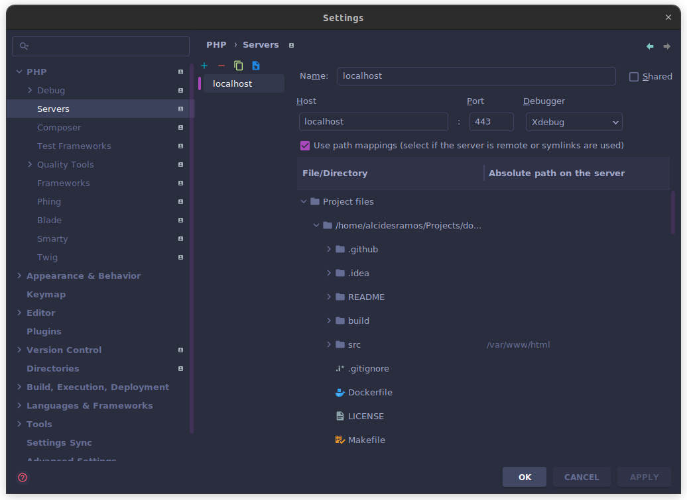
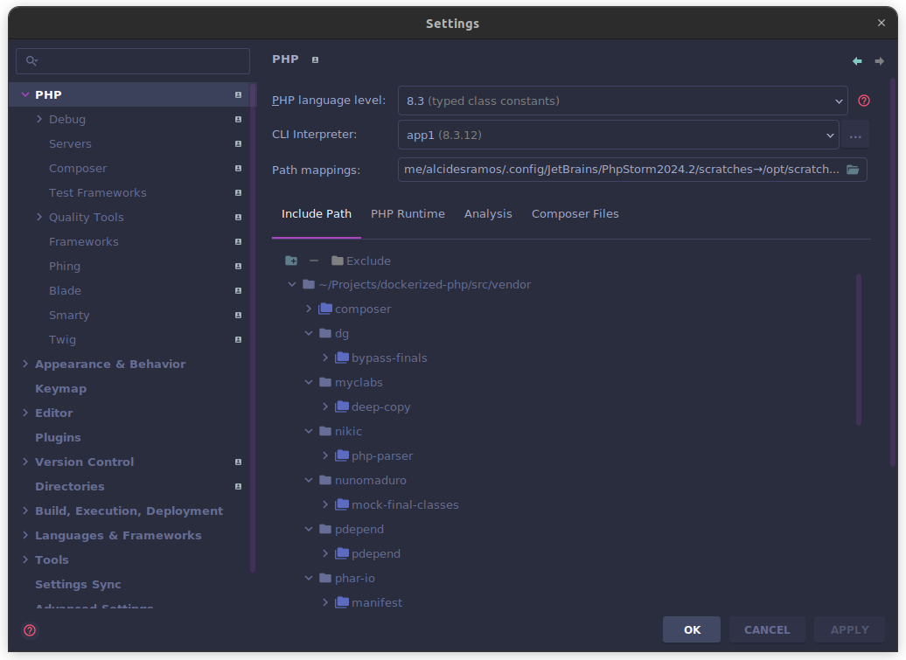
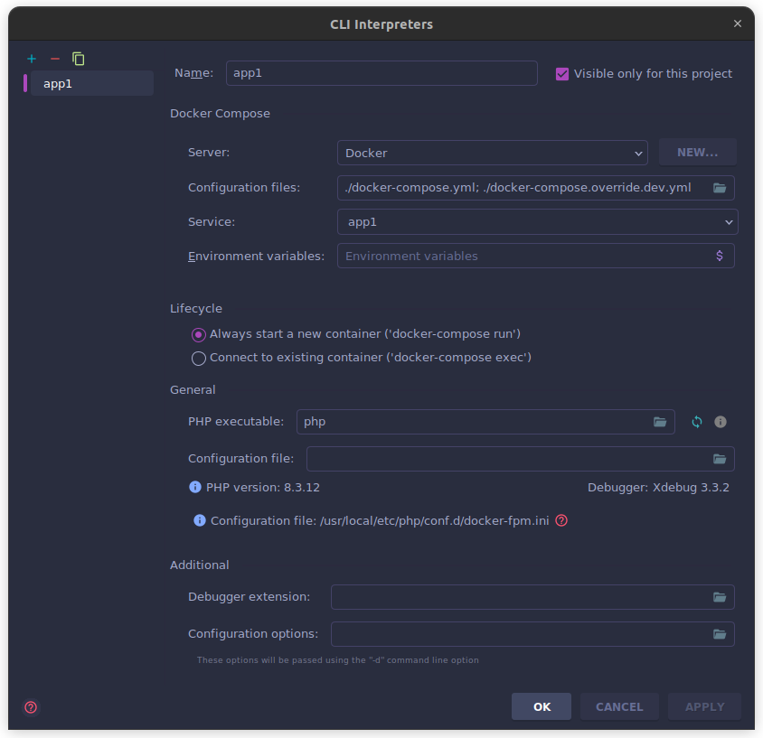
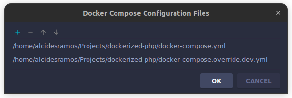

[](https://github.com/AlcidesRC/dockerized-php/actions/workflows/ci.yml)

# Dockerized PHP


> A _dockerized_ environment based on Caddy + PHP-FPM running on separated Linux Alpine containers. 


[TOC]

------


## Summary

This repository contains a _dockerized_ environment for building PHP applications based on **php:8.3.12-fpm-alpine** with Caddy support.

### Highlights

- Unified environment to build <abbr title="Command Line Interface">CLI</abbr>, <u>web applications</u> and/or <u>micro-services</u> based on **PHP8**.
- Multi-stage Dockerfile to allows you to create an optimized **development** or **production-ready** Docker images
- Uses **Caddy webserver**.
- **Self-signed local domains** thanks to Caddy.
- **Everything on separated Docker services**.


------


## Requirements

To use this repository you need:

- [Docker](https://www.docker.com/) - An open source containerization platform.
- [Git](https://git-scm.com/) - The free and open source distributed version control system.
- [Make](https://www.gnu.org/software/make/) - A command to automate the build/manage process.
- [jq](https://jqlang.github.io/jq/download/) - A lightweight and flexible command-line JSON processor.


------


## Built with

| Type           | Component                                                | Description                                                  |
| -------------- | -------------------------------------------------------- | ------------------------------------------------------------ |
| Infrastructure | [Docker](https://www.docker.com/)                        | Containerization platform                                    |
| Service        | [Caddy Server](https://caddyserver.com/)                 | Open source web server with automatic HTTPS written in Go    |
| Service        | [PHP-FPM](https://www.php.net/manual/en/install.fpm.php) | PHP with FastCGI Process Manager                             |
| Miscelaneous   | [Make](https://www.gnu.org/software/make/)               | Allows to execute commands defined on a _Makefile_           |
| Miscelaneous   | [jq](https://jqlang.github.io/jq/download/)              | Allows to beautify the Docker inspections in JSON format     |


------


## Getting Started

Just clone the repository into your preferred path:

```bash
$ mkdir -p ~/path/to/my-new-project && cd ~/path/to/my-new-project
$ git clone git@github.com:alcidesrc/dockerized-php.git .
```

### Conventions

#### Dockerfile

`Dockerfile` is based on [multi-stage builds](https://docs.docker.com/build/building/multi-stage/) in order to simplify the process to generate the **development container image** and the optimized **production-ready container image**.

##### Defined Stages

| Name                        | Description                                                                          |
| --------------------------- | ------------------------------------------------------------------------------------ |
| `base-image`                | Used to define the base Docker image                                                 |
| `common`                    | Used to define generic variables: `WORKDIR`, `HEALTCHECK`, etc.                      |
| `extensions-builder-common` | Used to build generic PHP extensions                                                 |
| `extensions-builder-dev`    | Used to build **development** PHP extensions                                         |
| `build-development`         | Used to build the development environment                                            |
| `optimize-php-dependencies` | Used to optimize the PHP dependencies in production by removing the development ones |
| `build-production`          | Used to build the **production** environment                                         |

###### Defined Stages Hierarchy



##### Health check

A custom health check script is provided to check the container service by performing the default `PHP-FPM` `ping/pong` check. 

You can find this shell script at `build/healthcheck.sh`.


> [!NOTE]
>
> Review the `Dockerfile` file and adjust the `HEALTHCHECK` directive options accordingly.


> [!IMPORTANT]
>
> Remember to rebuild the Docker image if you make any change on this file.


##### Non-Privileged User

Current container service uses a **non-privileged user** to execute `PHP-FPM`, with same User/Group ID than the host user.

This mechanism allows to `PHP-FPM` create/update shared resources within the host with the same credentials than current host user, avoiding possible file-permissions issues.

To create this user in the container service, current host user details are collected in the `Makefile` and passed to Docker `build` command as arguments:

| Argument          | Default value   | Required value        | Description                |
| ----------------- | --------------- | --------------------- | -------------------------- |
| `HOST_USER_NAME`  | host-user-name  | `$ id --user --name`  | Current host user name     |
| `HOST_GROUP_NAME` | host-group-name | `$ id --group --name` | Current host group name    |
| `HOST_USER_ID`    | 1000            | `$ id --user`         | Current host user ID       |
| `HOST_GROUP_ID`   | 1000            | `$ id --group`        | Current host user group ID |


> [!NOTE]
>
> Review the `Makefile` and `Dockerfile` files and adjust the arguments to your convenience.


> [!IMPORTANT]
>
> Remember to rebuild the Docker image if you make any change on `Dockerfile` file.


#### Logging

The container service logs to `STDOUT` by default.

#### Project Structure

```text
├── build                           	# Docker-related configuration files
│   ├── Caddyfile                   	# Caddy's configuration file
│   ├── healthcheck.sh              	# Shell script for Docker's HEALTHCHECK  directive
│   ├── www.conf                    	# PHP-FPM configuration file
│   └── xdebug.ini                  	# xDebug configuration file
├── README                              # README.md required assets
├── src                             	# PHP application folder
├── caddy-root-ca-authority.crt     	# Generated certificate file with Caddy Root CA Authority details
├── docker-compose.override.dev.yml     # Docker Compose file for development environment
├── docker-compose.override.prod.yml	# Docker Compose file for production environment
├── docker-compose.yml              	# Docker Compose base file
├── Dockerfile
├── LICENSE
├── Makefile
└── README.md
```

##### Volumes

There is a **bind volume** created between the *host* and the container service:

| Host path | Container path  | Description            |
| --------- | --------------- | ---------------------- |
| `./src`   | `/var/www/html` | PHP application folder |


> [!NOTE]
>
> Review the `docker-compose.xxx.yml` files and adjust the volumes to your convenience.


> [!IMPORTANT]
>
> Remember to rebuild the Docker image if you make any change on `Dockerfile` file.


##### Available Commands

A *Makefile* is provided with following commands:

```bash
~/path/to/my-new-project$ make

╔════════════════════════════════════════════════════════════════════════════════════════════════════════╗
║                                                                                                        ║
║                                    .: AVAILABLE COMMANDS :.                                            ║
║                                                                                                        ║
╚════════════════════════════════════════════════════════════════════════════════════════════════════════╝
· DOMAIN(s) .... https://localhost
· SERVICE(s) ... caddy app1
· USER ......... (1000) alcidesramos
· GROUP ........ (1000) alcidesramos

· build                               Docker: builds the service <env=[dev|prod]>
· up                                  Docker: starts the service <env=[dev|prod]>
· restart                             Docker: restarts the service <env=[dev|prod]>
· down                                Docker: stops the service <env=[dev|prod]>
· logs                                Docker: exposes the service logs <env=[dev|prod]> <service=[app1|caddy]>
· shell                               Docker: establish a shell session into main container
· inspect                             Docker: inspect the health for specific service <service=[app1|caddy]>
· install-caddy-certificate           Setup: extracts the Caddy Local Authority certificate
· install-skeleton                    Application: installs PHP Skeleton
· install-laravel                     Application: installs Laravel
· install-symfony                     Application: installs Symfony
· uninstall                           Application: removes the PHP application
· open-website                        Application: open the application website
· init                                Application: initializes the application
```

#### Web Server

This project uses Caddy as main web server which <u>provides HTTPS by default</u>.


> [!WARNING]
>
> Caddy is optional and you can replace/remove it based on your preferences.


##### Default Domain

The default website domain is https://localhost


> [!TIP]
>
> You can customize the domain name in `docker-compose.override.xxx.yml` 
>
> Review as well the `Makefile` to ensure `WEBSITE_URL` constant has the desired domain name for development environment.


> [!IMPORTANT]
>
> Remember to restart the container service(s) if you make any change on any Docker file.


##### Certificate Authority (CA) & SSL Certificate

You can generate/register the **Caddy Authority Certificate** in order to get `SSL` support .


> [!NOTE]
>
> Just execute `make install-caddy-certificate` and follow the provided guidelines to generate the Caddy Authority Certificate and install it on your host.


> [!IMPORTANT]
>
> Remember to reinstall the certificate if you rebuild the container service.


#### PHP Application

PHP application must be placed into `src` folder.


> [!TIP]
>
> There are some `Makefile` commands that allows you to install a [PHP Skeleton](https://github.com/alcidesrc/php-skeleton) as boilerplate or [Laravel](https://github.com/laravel/laravel) when creating `PHP` applications from scratch.


##### Testing

###### Mocking Date/Time functions

Testing with date and/or time variations sometimes can be a nightmare. To assist on this topic the **UOPZ** extension has been installed and enabled by default.


> [!TIP]
>
> You can use [slope-it/clock-mock](https://github.com/slope-it/clock-mock) as a development dependency when mocking date/time functions. 


### Development Environment

#### Quickstart

```bash
$ make init
```

##### TL;DR

###### Building the container

```bash
$ make build
```

###### Starting the container service

```bash
$ make up
```

###### Extracting Caddy Local Authority - 20XX ECC Root 

```bash
$ make install-caddy-certificate
```

###### Accessing to web application

```bash
$ make open-website
```

###### Stopping the container service

```bash
$ make down
```

#### Setup PHPStorm

##### Help > Change Memory Settings

To allow PHPStorm index huge projects consider to increase the default assigned memory amount from 2048 MiB up to 8192 MiB. 



##### Settings > PHP > Debug

Ensure the `Max. simultaneous connections` is set to 1 to avoid trace collisions when debugging.



##### Settings > PHP > Servers

Ensure the `~/path/to/my-new-project/src` folder is mapped to `/var/www/html`



##### Settings > PHP






> [!IMPORTANT]
>
> When selecting Docker Compose configuration files, ensure to include:
>
> 1. The `docker-compose.yml` file, which contains the default service(s) specification
> 2. The `docker-compose.override.dev.yml` file, which may contains some override values or customization from default specification.
>
> **The order on here is important!**





### Production Environment

#### Quickstart

```bash
$ make init env=prod
```

##### TL;DR

###### Building the container

```bash
$ make build env=prod
```

###### Starting the container service

```bash
$ make up env=prod
```

###### Extracting Caddy Local Authority - 20XX ECC Root 

```bash
$ make install-caddy-certificate env=prod
```

###### Accessing to web application

```bash
$ make open-website env=prod
```

###### Stopping the container service

```bash
$ make down env=prod
```

#### 

------


## Security Vulnerabilities

Please review our security policy on how to report security vulnerabilities:

**PLEASE DON'T DISCLOSE SECURITY-RELATED ISSUES PUBLICLY**

### Supported Versions

Only the latest major version receives security fixes.

### Reporting a Vulnerability

If you discover a security vulnerability within this project, please [open an issue here](https://github.com/alcidesrc/dockerized-php/issues). All security vulnerabilities will be promptly addressed.


------


## License

The MIT License (MIT). Please see [LICENSE](./LICENSE) file for more information.
